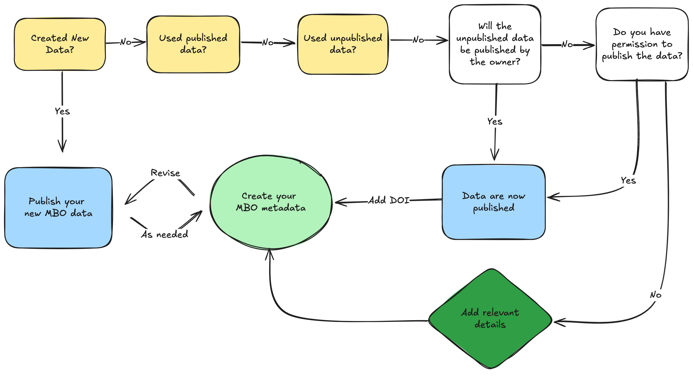

# Steps for Publishing and Creating MBO Metadata

**The goal of MBO is that all meta(data) should be published.**

---

## Before You Begin: Assessment Questions

Answer these questions to help plan your data publishing and metadata creation:

### About Your Data and Code

1. **What types of data did you create?**
   - *Why this matters:* Raw data and processed data may need different publishers. We can recommend the right repositories for each type.

2. **Did you use any unpublished data from others?**
   - *Why this matters:* These datasets should also be published. Determine who will publish them and whether there are any restrictions.

3. **Did you write custom code or scripts?**
   - *Why this matters:* Code should be published in a software archive (we recommend Zenodo), separate from your data.
   - *Note:* This excludes simple Excel formulas.

4. **Where are your data currently stored and in what formats?**
   - *Why this matters:* Helps us advise on the steps needed to prepare your data for publication.

5. **How easy would it be for someone else to understand your data?**
   - *Why this matters:* Spreadsheets and text files should be clear enough for an unknown person to use. Add documentation if needed.

### About Your Metadata

6. **Did you use any already-published data?**
   - *Why this matters:* We need to include information about these source datasets in your metadata.

7. **Did you use any unpublished or restricted-access data?**
   - *Why this matters:* We need to document these appropriately without requiring publication.

8. **Who on your team knows the data creation process in detail?**
   - *Why this matters:* We may need to contact this person with questions during metadata review.

9. **Have you documented your workflow?**
   - *Why this matters:* Understanding your process helps us provide better guidance and makes metadata creation easier.

## When you're done, you should have:

   ### 1. A list of your data

   - Includes all raw data (e.g., measurements, images, sequences) and processed data (e.g., computed values, analysis results, species lists)
   - Includes any donated, unpublished data that may need publishing

   ### 2. Publicly available metadata, including:

   - All MBO metadata linked with dataset DOI/URL
   - Published all data in a FAIR repository or metadata catalogue:
     - An appropriate data publisher for your data type
     - Complete records of all required metadata fields (aim for comprehensive coverage)
     - A DOI minted, if available; permanent URLs are acceptable
     - Open access licenses (CC0 or CCBY) applied to your data (this is required by MBO). Other licenses may meet the requirements of MBO. A good starting point for exploration is: https://spdx.org/licenses/

_Please discuss exceptions with WP1_

---

## What? Where? How does this work?

You will enter the metadata on Google Sheets* [link](https://docs.google.com/spreadsheets/d/1PBFK3LW3DAdvXdbk2v8bSdtTf87mBhabeeegwRjOBRg/edit?gid=690350717#gid=690350717), each tab covers a topic. For example:

- Action: The research activities that led to specific data
- Dataset: Information about your research datasets
- Person: Researchers, contributors, etc.  
- Place: Geographic locations and study sites
- Document: Publications, reports, documentation
- HowTo: Description of protocols
- _And more…_

See https://lab.marcobolo-project.eu/csv-to-json-ld/ for the full list and documentation

_Note that we are using Google Sheets, but in the model underlying the tool, these tabs are referred to as CSVs._

---

## Start with describing Actions

We recommend you start with [Actions](https://lab.marcobolo-project.eu/csv-to-json-ld/Action.html): 

#### Actions describe the series of events that generated the data

- Who did the actions
- What inputs were used?
- What outputs were created?
- Your final action is the publishing of your MBO data.

#### What exactly is an Action?

**You decide.** As a scientist, what are the blocks of information you would expect someone to convey about the process to so you can understand the science?

Standards will vary across data types and scientific communities, but the goal in MBO is to describe as much metadata as possible.

## Examples of Actions

<strong>Example 1: Coastal Water Quality Monitoring</strong>

**Parent Action:** "Coastal Water Quality Assessment - Adriatic Sea 2024"

### Child Action 1: "Water Sample Collection"
- People and Organizations: Field sampling team
- HowTo & Document: Sampling protocols
- Dataset: Raw water samples with metadata

### Child Action 2: "Laboratory Chemical Analysis"
- People and Organizations: Lab tech(s)
- HowTo & Document: Analytical protocols
- Dataset: Nutrient concentration data, pH measurements

### Child Action 3: "Data Quality Control and Processing"
- People and Organizations: Data analyst(s)
- HowTo & Document: QC protocols
- Dataset: Validated dataset ready for publication

### Child Action 4: "Data Publication"
- People and Organizations: Data Manager(s)
- HowTo & Document: Data Management Plan & Protocols
- Dataset & Document: Archived dataset, primary publication

<strong>Example 2: Marine Biodiversity Survey (eDNA)</strong>

**Parent Action:** "Marine Biodiversity Assessment via Environmental DNA"

### Child Action 1: "eDNA Sample Collection"
- People and Organizations: Marine biologist
- HowTo & Document: Sampling protocols
- Dataset: Filtered water samples preserved for analysis with metadata

### Child Action 2: "DNA Extraction and Library Preparation"
- People and Organizations: Molecular lab specialist
- HowTo & Document: Extraction and library prep protocols
- Datasets: DNA extracts and libraries ready for sequencing

### Child Action 3: "High-Throughput Sequencing"
- People and Organizations: Sequencing facility
- HowTo and Document: Sequencing protocols
- Dataset: Raw sequence data files

### Child Action 4: "Bioinformatics Analysis and Species Identification"
- People and Organizations: Bioinformatician
- HowTo & Document: Protocols, software, services, reference databases
- Dataset: Representative reads, species occurrence dataset with taxonomic assignments

### Child Action 5: "Data Publication"
- People and Organizations: Data Manager(s)
- HowTo & Document: Data Management Plan & Protocols
- Dataset & Document: Archived dataset, primary publication

<strong>Example 3: Ocean Current Modeling Study</strong>

**Parent Action:** "Mediterranean Current Pattern Analysis Using Satellite Data"

### Child Action 1: "Satellite Data Acquisition and Preprocessing"
- People and Organizations: Remote sensing specialist
- HowTo & Document & Dataset: Satellite imagery, processing algorithms, software
- Dataset: Calibrated sea surface height and temperature datasets

### Child Action 2: "Oceanographic Model Configuration"
- People and Organizations: Physical oceanographer
- HowTo & Document: Boundary conditions, model parameters
- Dataset: Configured numerical ocean model

### Child Action 3: "Model Simulation and Validation"
- People and Organizations: Computational scientist
- HowTo & Document: Configured model, observational data for validation, software, service
- Dataset: Validated current velocity and transport datasets

### Child Action 4: "Data Publication"
- People and Organizations: Data Manager(s)
- HowTo & Document: Data Management Plan & Protocols
- Dataset & Document: Archived dataset, primary publication

<strong>Example 4: Meta-Analysis of Conservation Interventions</strong>

**Parent Action:** "Meta-Analysis of Marine Protected Area Effectiveness on Fish Biodiversity"

### Child Action 1: "Literature Search and Screening"
- People and Organizations: Research team, librarian
- HowTo & Document: Search protocol, inclusion/exclusion criteria, PRISMA guidelines
- Dataset: Bibliography of candidate studies, screening decisions database

### Child Action 2: "Data Extraction from Publications"
- People and Organizations: Research assistants, domain experts
- HowTo & Document: Data extraction protocol, coding scheme
- Dataset: Extracted effect sizes, study characteristics, intervention details

### Child Action 3: "Data Quality Assessment and Harmonization"
- People and Organizations: Lead researcher, statistician
- HowTo & Document: Quality assessment criteria, data standardization protocols
- Dataset: Quality-coded dataset, harmonized effect size measurements

### Child Action 4: "Statistical Analysis and Synthesis"
- People and Organizations: Statistician, meta-analysis specialist
- HowTo & Document: Statistical analysis plan, software scripts, meta-analysis methods
- Dataset: Pooled effect estimates, heterogeneity statistics, subgroup analyses

### Child Action 5: "Results Publication and Data Archiving"
- People and Organizations: Research team, data manager
- HowTo & Document: Data Management Plan & Protocols
- Dataset & Document: Published meta-analysis paper, archived analysis dataset with documentation

---
## Step-by-Step Data Entry Guide

[Workflow Diagram](workflow_diagram/workflow_diagram.html)

#### Required vs Optional Fields

**Required fields** have:
- Bold column headers
- Yellow background color
- Will cause validation errors if left empty

**Optional fields** provide additional context and improve discoverability but aren't mandatory.

##### Use Built-in Validation

The sheets provide real-time help:
- **Dropdown menus** for fields that reference other records
- **Header tooltips** (hover over headers) with detailed guidance
- **Format validation** for dates, emails, URLs
- **Duplicate detection** red highlights flag IDs that already exist in a column

#### Field Relationships

Many fields reference other records using IDs:
- `authorId` → Person or Organization record
- `spatialCoveragePlaceMboId` → Place record
- `metadataDescribedForActionId` → Action record

Use the dropdown menus to select valid references, or type the ID directly if you know it.

--- 

### After you've drafted your Actions...

Before describing datasets, you'll need to establish:

**Action record** (for your research activity):
- Use the Action tab to describe the project or task generating this metadata
- Note the assigned ID - every other record will reference this
- Don't worry if it's not perfect, you can always come back and revise it.

**Person record** (for yourself as metadata publisher):
- Use the Person tab to create your researcher profile
- Note your assigned ID (e.g., `mbo_person_001`) - you'll reference this elsewhere

**Organization record** (for your institution):
- Use the Organization tab for your research institution
- Note the assigned ID for references

### If it makes sense...

- Fill out information in the MonetaryGrant tab
- Fill out information in the ContactPoint tab

### Describe Geography

- If relevant, fill out information in the Place tab
- Same for the GeoShape tab

### License should be pre-populated

- Review the licenses listed on the License tab. If one is not siutable for your needs, add a new one.

### Enter Dataset Information

Once core records exist:
- Go to the Dataset tab
- Fill in required fields (marked with bold headers and yellow background)
- Reference your Person ID in `metadataPublisherId`
- Reference your Action ID in `metadataDescribedForActionId`

## Data Quality Tips

**Use consistent naming**: Keep terminology consistent across related records.

**Provide examples in multivalued fields**: Use pipe separators (|) for multiple values: `Marine Biology|Climate Change|Biodiversity`

**Include comprehensive descriptions**: Rich metadata helps others discover and understand your data.

**Reference existing records**: Before creating new Person or Organization records, check if they already exist.

## Getting Help

**Column tooltips**: Hover over any column header for detailed guidance about that field.

**Validation feedback**: If cells highlight in red or validation fails, read error messages carefully.

**Contact support**: For questions about data entry, contact the MARCO-BOLO WP1 team.

## After Data Entry

Your data is automatically synchronized with the processing system nightly. The WP1 team monitors data validation and will contact you if any issues need resolution.

Validated data becomes part of the MARCO-BOLO metadata catalog and is made discoverable through international research platforms, beginning with ODIS.

---