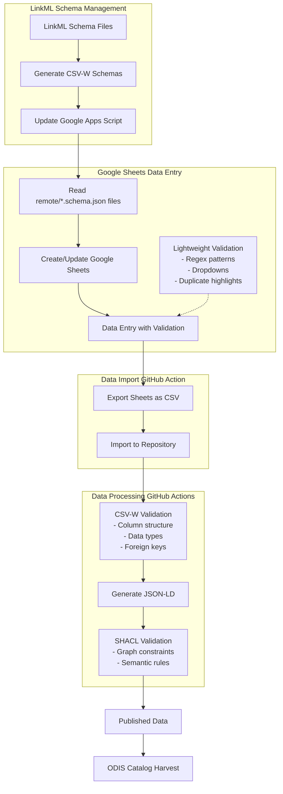

# MARCO-BOLO Complete System Documentation

## System Overview

The MARCO-BOLO project demonstrates how small research teams can produce publication-ready, semantically rich metadata using minimal infrastructure. The system leverages familiar tools like Google Sheets for data entry, automated validation through LinkML schemas, and generates machine-readable JSON-LD that exceeds typical metadata standards for marine biodiversity projects.

But, someone has to take develop and manager this system. This protocol outlines the model, software stack, and basic management tasks.


**Figure 1:** CSV-to-JSON-LD Workflow: The process begins when a data model, captured as a LinkML schema, is converted to CSV-W format. A Google Apps Script is triggered by a WP1 member, as needed, to create or update Google Sheets formatting and validation rules, without overwriting the data. Researchers then enter data into these structured sheets. The sheets provide some validation through dropdowns and pattern matching. A GitHub Action automatically syncs the data on each tab to a CSV file in the project repository. This happens every night at UTC 01:00. Once synced, the processing pipeline automatically applies three layers of validation: CSV-W validation ensures data structure and types match the schema, JSON-LD generation transforms the data into semantic web format, and SHACL validation checks complex relationships and business rules. The final structured data is published as a GitHub Action artifact. However, it will soon be updated to be output into a GitHub directory that will be registered with ODIS.

## Core Components

### 1. LinkML Schema Management
**Location**: `remote/models/`
**Key Files**:
- `slots.yaml` - Field definitions and constraints
- `classes.yaml` - Entity definitions and relationships  
- `literals.yaml` - Custom data types
- `mkdocs.yml` - Documentation configuration

**Purpose**: Defines the semantic model for marine biodiversity data using LinkML, which generates CSV-W schemas for validation and JSON-LD mapping.

### 2. Google Apps Script Integration
**Location**: Google Apps Script project linked to spreadsheet
**Key Script**: "update sheets from GitHub.gs"
**Purpose**: Automatically creates and maintains Google Sheets based on CSV-W schemas, providing user-friendly data entry interface.

### 3. CSV-W Schema Generation
**Location**: `remote/scripts/mbocsvwscripts/generatecsvwdefinitions.py`
**Purpose**: Converts LinkML schemas to CSV-W format with validation rules and semantic mappings.

### 4. Data Validation Pipeline
**Multiple Layers**:
- **Google Sheets**: Real-time validation (regex, dropdowns, duplicates)
- **CSV-W**: Structure validation (columns, types, foreign keys)
- **SHACL**: Semantic validation (graph-level constraints)

### 5. GitHub Actions Automation
**Data Import Action**: Pulls CSV data from Google Sheets into repository
**Processing Actions**: Validates data and generates JSON-LD output

## Complete Workflow Documentation

### Phase 1: Schema Updates (When Adding New Data Types)

#### Prerequisites
- Git repository access with write permissions
- Understanding of LinkML syntax
- Docker (for testing with PR containers)

#### Process

1. **Create Development Branch**
   ```bash
   git checkout -b feature/model-update-$(date +%Y-%m-%d)
   ```

2. **Update LinkML Schema**
   
   **Add new slots** to `remote/models/slots.yaml`:
   ```yaml
   new_slot_name:
     title: "User-Facing Column Name"
     description: "Technical definition for developers"
     required: true
     multivalued: false
     range: string
     slot_uri: schema:propertyName
     comments: |
       User-friendly explanation that becomes tooltip in Google Sheets.
       Include examples: `example1`, `example2`
       For multivalued fields: Pipe-delimited when multiple values
   ```

   **Add/modify classes** in `remote/models/classes.yaml`:
   ```yaml
   NewEntityType:
     description: "What this entity represents"
     class_uri: schema:Thing
     slots:
       - id
       - metadataPublisherId
       - metadataDescribedForActionId
       - new_slot_name
       # ... other slots
   ```

   **Update PID mapping** in `generatecsvwdefinitions.py`:
   ```python
   _MAP_CSV_NAME_TO_PID_URI = {
       # ... existing mappings ...
       'NewEntityType.csv': f"{_MBO_PREFIX}mbo_0000XXX",  # Use next sequential number
   }
   ```

3. **Validate Locally**
   ```bash
   # Check YAML syntax
   python -c "import yaml; yaml.safe_load(open('remote/models/slots.yaml'))"
   python -c "import yaml; yaml.safe_load(open('remote/models/classes.yaml'))"
   
   # Test schema generation
   python remote/scripts/mbocsvwscripts/generatecsvwdefinitions.py -o test-output remote/models/classes.yaml
   rm -rf test-output
   ```

4. **Generate CSV-W Schemas**
   ```bash
   python remote/scripts/mbocsvwscripts/generatecsvwdefinitions.py -o temp-output remote/models/classes.yaml
   cp -r temp-output/remote/* remote/
   rm -rf temp-output
   ```

5. **Update Documentation**
   Add new entity to `remote/models/mkdocs.yml`:
   ```yaml
   nav:
     - CSV files:
       # ... existing entries ...
       - NewEntityType: NewEntityType.md
   ```

6. **Commit and Push**
   ```bash
   git add remote/models/ remote/scripts/ remote/*.json remote/*.md
   git commit -m "Add NewEntityType to LinkML model
   
   - Added slots: new_slot_name
   - Updated CSV-W schemas with validation rules  
   - Added documentation structure"
   
   git push origin feature/model-update-$(date +%Y-%m-%d)
   ```

7. **Test with PR Container**
   ```bash
   # Wait for GitHub Actions to build PR container
   docker pull ghcr.io/marco-bolo/csv-to-json-ld-tools:pr-XX  # Replace XX with PR number
   # Test your changes if needed
   ```

### Phase 2: Google Sheets Integration (After Schema Merge)

#### Prerequisites
- Schema changes merged to main branch
- Access to Google Apps Script project
- Google Sheets with appropriate sharing permissions

#### Process

1. **Update Google Apps Script URLs** (if needed)
   Ensure these point to main branch:
   ```javascript
   const GITHUB_RAW_BASE = "https://raw.githubusercontent.com/marco-bolo/csv-to-json-ld/main/remote/";
   const SLOT_YAML_URL = "https://raw.githubusercontent.com/marco-bolo/csv-to-json-ld/main/remote/models/slots.yaml";
   ```

2. **Run Sheet Generation Script**
   - Open Google Apps Script project
   - Run `generateSheetsFromCSVW()` function
   - Monitor execution logs for errors
   - Verify new sheets are created with proper validation

3. **Verify Sheet Structure**
   - Check that all columns are present
   - Verify required fields are highlighted
   - Test dropdown validations for foreign keys
   - Confirm header tooltips show user guidance

### Phase 3: Data Collection and Processing

#### Data Entry Process
1. **Users enter data** in Google Sheets with real-time validation
2. **GitHub Action imports** sheet data as CSV files to repository
3. **Processing pipeline** validates and transforms data:
   - CSV-W validation (structure, types, foreign keys)
   - JSON-LD generation (semantic mapping)
   - SHACL validation (graph-level constraints)
4. **Published data** becomes available for catalog harvesting

## Key Files and Locations

### LinkML Schema Files
```
remote/models/
├── slots.yaml              # Field definitions and validation rules
├── classes.yaml            # Entity types and their slot assignments  
├── literals.yaml           # Custom data types (rarely modified)
└── mkdocs.yml              # Documentation structure
```

### Generated CSV-W Schemas
```
remote/
├── Action.schema.json      # CSV-W schema for Action data
├── Dataset.schema.json     # CSV-W schema for Dataset data
├── Document.schema.json    # CSV-W schema for Document data
└── [Entity].schema.json    # One schema file per entity type
```

### Processing Scripts
```
remote/scripts/mbocsvwscripts/
└── generatecsvwdefinitions.py  # LinkML to CSV-W converter
```

### Google Apps Script
- **Project**: Linked to main Google Spreadsheet
- **Key Function**: `generateSheetsFromCSVW()`
- **Purpose**: Reads CSV-W schemas and creates/updates sheet structure

## Validation Layers Explained

### Layer 1: Google Sheets (Real-time)
**When**: During data entry
**What**:
- Regex pattern validation (email formats, ID patterns)
- Dropdown lists for foreign key references
- Duplicate ID highlighting
- Required field enforcement

**Limitations**: Basic validation only, can't enforce complex relationships

### Layer 2: CSV-W (Structural)  
**When**: After data import to repository
**What**:
- Column presence and naming
- Data type validation (dates, numbers, URLs)
- Foreign key reference checking
- Cardinality constraints (single vs. multiple values)

**Purpose**: Ensures data structure matches schema before semantic processing

### Layer 3: SHACL (Semantic)
**When**: After JSON-LD generation
**What**:
- Graph-level constraint validation
- Complex relationship rules
- Semantic consistency checking
- Domain-specific business rules

**Purpose**: Validates the meaning and relationships in the final semantic data

## Troubleshooting Guide

### Common LinkML Issues

**YAML Syntax Errors**
```
Error: yaml.parser.ParserError: did not find expected key
```
- Check indentation (spaces only, no tabs)
- Ensure all keys end with colons
- Verify quotes are properly closed

**Missing Slot References**
```
Error: Slot 'unknown_slot' referenced but not defined
```
- Add slot definition to `slots.yaml`
- Check spelling in class slot lists
- Verify slot is properly indented

**PID Mapping Issues**
```
Error: No PID found for Entity.csv
```
- Add mapping to `_MAP_CSV_NAME_TO_PID_URI` in `generatecsvwdefinitions.py`
- Use sequential numbering (`mbo_0000XXX`)
- Match CSV filename exactly

### Google Apps Script Issues

**404 Errors When Fetching Schemas**
```
Exception: Request failed for https://raw.githubusercontent.com returned code 404
```
- Verify schema files exist in repository
- Check branch name in URLs (should be `main`)
- Confirm files were committed and pushed

**Sheet Creation Failures**
```
Error: Cannot create sheet with name 'Entity'
```
- Check for duplicate sheet names
- Verify Google Apps Script has edit permissions
- Ensure spreadsheet isn't at sheet limit

**Foreign Key Dropdown Issues**
- Target sheet must exist before source sheet
- Column names must match exactly
- Foreign key definitions must be in CSV-W schema

### Data Processing Issues

**CSV-W Validation Failures**
- Check column names match schema exactly
- Verify data types (dates as YYYY-MM-DD, numbers without commas)
- Ensure foreign key values exist in target sheets

**JSON-LD Generation Errors**
- Usually indicates CSV-W validation issues
- Check for required fields with empty values
- Verify multivalued fields use pipe delimiters

## Backup and Recovery

### Schema Backup
- All schema files are version-controlled in Git
- Each change creates new commit with full history
- Generated schemas can be recreated from LinkML source

### Data Backup
- Google Sheets data is automatically synced
- Repository contains CSV snapshots after each import
- JSON-LD outputs are preserved in processing pipeline

### Recovery Process
1. **Schema corruption**: Revert to last known good commit
2. **Sheet structure issues**: Re-run Google Apps Script generation
3. **Data loss**: Restore from repository CSV files or Google Sheets revision history

## Handover Checklist

For someone taking over this system:

### Immediate Access Needed
- [ ] GitHub repository write access
- [ ] Google Apps Script project access  
- [ ] Google Spreadsheet edit permissions
- [ ] Understanding of LinkML syntax basics

### Key Concepts to Understand
- [ ] LinkML schema structure and validation
- [ ] CSV-W format and its relationship to JSON-LD
- [ ] Google Apps Script execution and debugging
- [ ] Multi-layer validation approach
- [ ] GitHub Actions workflow for data processing

### Essential Skills
- [ ] YAML syntax and debugging
- [ ] Basic Python for script modifications
- [ ] Google Apps Script JavaScript
- [ ] Git workflow for collaborative development
- [ ] Understanding of semantic web concepts (RDF, JSON-LD)

### Emergency Contacts
- Previous system maintainer
- LinkML community (GitHub issues, Slack)
- MARCO-BOLO project stakeholders

### First Steps When Taking Over
1. Clone repository and explore file structure
2. Run schema generation locally to understand process
3. Test Google Apps Script execution in read-only mode
4. Review recent commit history to understand change patterns
5. Identify and contact key users/stakeholders
6. Set up monitoring for GitHub Actions failures

## Monitoring and Maintenance

### Regular Tasks
- Monitor GitHub Actions for processing failures
- Review Google Apps Script execution logs
- Update schema documentation when changes are made
- Respond to user questions about data entry

### Signs of Problems
- Users reporting validation errors in sheets
- GitHub Actions consistently failing
- 404 errors from Google Apps Script
- Inconsistent data between sheets and repository

### Update Frequency
- Schema updates: As needed when new data types required
- Google Apps Script: Only when schema structure changes significantly  
- Documentation: With each schema update
- User training: When interface changes affect data entry process